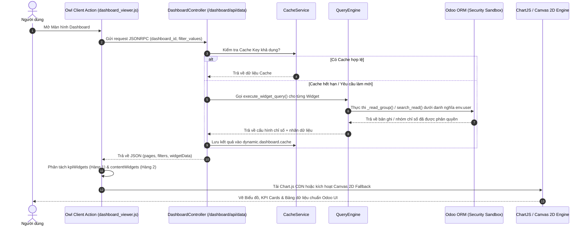

# Universal Dynamic Dashboard Builder (`aidt_dashboard_builder`)
> **Phân hệ Dashboard Động No-Code Chuyên Nghiệp Cho Odoo 19 (Enterprise Edition)**

---

## 📌 1. BẢNG TỔNG QUAN HỆ THỐNG

| Hạng mục | Chi tiết kỹ thuật |
| :--- | :--- |
| **Module Name** | `aidt_dashboard_builder` |
| **Phiên bản Odoo** | **Odoo 19.0+** (Tương thích OWL 2 Framework) |
| **Phụ thuộc (Depends)** | `base`, `web`, `hr`, `mail` |
| **Giấy phép (License)** | LGPL-3 |
| **Công nghệ Frontend** | Odoo Owl 2, Chart.js v4, HTML5 Canvas 2D Fallback Engine, Bootstrap 5, SCSS |
| **Công nghệ Backend** | Odoo 19 ORM, JSONRPC API, Dynamic Domain Compiler, Security Whitelist Engine |

---

## 🚀 2. CÁC TÍNH NĂNG NỔI BẬT

1. **No-Code Visual Query Builder (Bộ dựng truy vấn không gõ code)**:
   * Chọn trực tiếp Model, Trường Gom nhóm (GroupBy), Trường Tính chỉ số (Measure) và Cột hiển thị bằng Dropdown chuẩn Odoo.
   * Tự động nhận diện kiểu dữ liệu: Phân biệt chính xác giữa trường liên kết Many2one và trường Ngày tháng (`Date`/`Datetime`).
2. **Hỗ trợ 10 loại Widget Đồ họa**:
   * **Thẻ KPI (KPI Card)**: Đếm số lượng, Tính tổng (Sum), Trung bình (Average), Nhỏ nhất (Min), Lớn nhất (Max).
   * **6 loại Biểu đồ (Charts)**: Biểu đồ Cột (Bar), Thanh ngang (Horizontal Bar), Đường (Line), Miền (Area), Tròn (Pie), Donut.
   * **Bảng Dữ liệu (Table)**: Phân trang bản ghi, giới hạn hiển thị (Limit) và nút bấm **Xem tất cả (Drilldown)** mở thẳng màn hình Odoo.
   * **Phím tắt & Hoạt động (Shortcut & Activity)**: Truy cập nhanh và theo dõi nhật ký hoạt động.
3. **Kiến trúc Phân quyền Bảo mật 3 Lớp (3-Tier Security Architecture)**:
   * **Cấp độ Hệ thống (ACL)**: Phân biệt rõ giữa *Người dùng Dashboard* (`group_dashboard_user`) và *Quản trị Dashboard* (`group_dashboard_manager`).
   * **Cấp độ Dashboard (Sharing Rules)**: Phân quyền theo Trạng thái (Dự thảo/Đã xuất bản), Danh sách người xem chỉ định (`viewer_ids`), Nhóm quyền (`group_ids`) và Công ty (`company_ids`).
   * **Cấp độ Bản ghi (Row-Level Security)**: Tất cả truy vấn ORM chạy dưới danh nghĩa tài khoản đang đăng nhập (`env.user`), đảm bảo dữ liệu Mật/Tuyệt mật tự động được lọc bỏ chính xác theo phân quyền Odoo.
4. **Bộ Đồ Họa Đa Năng (Dual Graphic Rendering Pipeline)**:
   * Tự động tải thư viện đồ họa **Chart.js v4 CDN** cho hiệu ứng mượt mà.
   * Tích hợp sẵn **Canvas 2D Engine Dự phòng (Offline Fallback)** đảm bảo 100% Biểu đồ luôn hiển thị hoàn hảo ngay cả khi mất kết nối Internet.
5. **Giao diện chuẩn Odoo 19 Native Aesthetic Design System (`design-taste-frontend`)**:
   * Tông màu chủ đạo **Odoo Aubergine Purple (`#714B67`)** & **Odoo Teal (`#00A09D`)**.
   * Bo góc `12px`, đổ bóng tinh tế và hiệu ứng Micro-interaction nhấc nhẹ 2px khi Hover.

---

## 🏗️ 3. KIẾN TRÚC THƯ MỤC VA FILE CẤU TRÚC

```text
aidt_dashboard_builder/
├── __manifest__.py                 # Khai báo dependencies, data XML và web.assets_backend
├── security/
│   ├── dashboard_groups.xml        # Định nghĩa Nhóm quyền User / Manager
│   ├── dashboard_rules.xml         # Định nghĩa Record Rules phân quyền truy cập
│   └── ir.model.access.csv         # Phân quyền CRUD trên các Models của Dashboard
├── data/
│   ├── dashboard_cron.xml          # Cron Job tự động làm sạch Cache dữ liệu
│   └── dashboard_templates.xml     # Templates mẫu khởi tạo mặc định
├── models/
│   ├── dashboard.py                # Model dynamic.dashboard (Quản lý Dashboard & Phân quyền)
│   ├── dashboard_page.py           # Model dynamic.dashboard.page (Trang / Tabs Navigation)
│   ├── dashboard_widget.py         # Model dynamic.dashboard.widget (Cấu hình Widget & No-code Engine)
│   ├── dashboard_filter.py         # Model dynamic.dashboard.filter (Bộ lọc dùng chung)
│   └── dashboard_cache.py          # Model dynamic.dashboard.cache (Bộ nhớ đệm hiệu năng cao)
├── services/
│   ├── query_engine.py             # Động cơ thực thi truy vấn ORM safe (search_count, _read_group, search_read)
│   ├── query_validator.py          # Động cơ kiểm duyệt danh sách trắng (Whitelist Validation)
│   ├── domain_compiler.py          # Biên dịch bộ lọc JSON sang Odoo Domain
│   ├── metadata_service.py        # Lấy danh sách Models & Fields cho No-code UI
│   └── cache_service.py           # Quản lý tạo Key Cache & Invalidation
├── providers/
│   ├── base_provider.py            # Abstract Base Class cho Data Providers
│   ├── odoo_provider.py            # Provider lấy dữ liệu từ Odoo ORM Models
│   ├── static_provider.py          # Provider cho dữ liệu tĩnh / Phím tắt
│   └── provider_registry.py        # Registry đăng ký các Data Providers
├── controllers/
│   └── dashboard_controller.py     # JSONRPC Endpoints API (/dashboard/api/list, /dashboard/api/data, metadata)
├── static/
│   └── src/
│       ├── actions/
│       │   ├── dashboard_viewer.js # Owl Client Action chính hiển thị Dashboard
│       │   └── dashboard_viewer.xml# Template XML cho Header, Tabs Bar, KPI Row & Content Grid
│       ├── services/
│       │   └── widget_registry.js  # Registry đăng ký Widget Frontend
│       ├── style/
│       │   └── dashboard.scss      # SCSS Design Tokens chuẩn Odoo 19 Native Aesthetic
│       └── widgets/
│           ├── kpi/ (kpi_widget.js, kpi_widget.xml)
│           ├── chart/ (chart_widget.js, chart_widget.xml)
│           ├── table/ (table_widget.js, table_widget.xml)
│           ├── activity/ (activity_widget.js, activity_widget.xml)
│           └── shortcut/ (shortcut_widget.js, shortcut_widget.xml)
└── README.md                       # Tài liệu hướng dẫn sử dụng và kiến trúc chi tiết
```

---

## 🔄 4. LUỒNG XỬ LÝ DỮ LIỆU & PIPELINE (DATA PIPELINE & FLOW)

### 🔹 Luồng 1: Tải và Hiển thị Dashboard trên Browser Client


---

## 🛠️ 5. CÁC LOGIC NÒNG CỐT & THUẬT TOÁN QUAN TRỌNG

### 1. Thuật toán Biên dịch No-Code sang JSON (`models/dashboard_widget.py`)
Khi người dùng chọn các trường trực quan trên Form view, `@api.onchange` tự động tạo JSON:
```python
@api.onchange('group_by_field_id', 'date_granularity')
def _onchange_dimension_visual(self):
    if self.group_by_field_id:
        field_name = self.group_by_field_id.name
        f_type = self.group_by_field_id.ttype
        granularity = self.date_granularity or 'month'
        self.dimension_json = json.dumps([{
            "field": field_name,
            "type": f_type,
            "granularity": granularity
        }])
```

### 2. Thuật toán Xử lý Thông minh Trường Gom Nhóm (`services/query_engine.py`)
Kiểm tra kiểu dữ liệu thực tế của trường trong Odoo ORM. Nếu không phải kiểu `Date`/`Datetime` (ví dụ trường `Many2one` như *Đơn vị*), hệ thống tự động loại bỏ chu kỳ thời gian `:month`/`:year` để ORM nhóm chính xác:
```python
field_type = model_obj._fields[groupby_field].type if groupby_field in model_obj._fields else 'char'
if field_type in ('date', 'datetime'):
    groupby_expr = f"{groupby_field}:{granularity}"
else:
    groupby_expr = groupby_field
```

### 3. Thuật toán Bảo mật Whitelist Validation (`services/query_validator.py`)
Hệ thống chặn đứng các nguy cơ SQL Injection hoặc xem trộm dữ liệu bằng cách đối chiếu tên Model và Field với danh sách whitelist chuẩn của Odoo Metadata.

---

## 🎨 6. BỘ TOKENS THIẾT KẾ (ODOO 19 DESIGN TOKENS)

| Token Name | Giá trị Hex / CSS | Mục đích sử dụng |
| :--- | :--- | :--- |
| `$odoo-purple` | `#714B67` | Màu tím Odoo chủ đạo cho KPI Primary, Nút bấm & Card top border |
| `$odoo-teal` | `#00A09D` | Màu xanh ngọc Odoo cho Biểu đồ, Nút thông tin & Accent |
| `$odoo-bg-light` | `#f8f9fa` | Màu nền Canvas mượt mà, thoáng mắt |
| `$odoo-border` | `#e9ecef` | Đường viền thẻ nhẹ nhàng |
| `Card Border Radius` | `12px` | Bo góc chuẩn Odoo 19 Backend |
| `Card Elevation` | `0 1px 3px rgba(0,0,0,0.04)` | Đổ bóng tinh tế chuẩn Enterprise |

---

## 📖 7. HƯỚNG DẪN SỬ DỤNG CHO NGƯỜI DÙNG CỦA HỆ THỐNG

### Bước 1: Tạo Dashboard Mới
1. Truy cập phím tắt menu **Dashboard Builder** ➔ Chọn **Danh sách Dashboards**.
2. Nhấn nút **Tạo mới (New)**, nhập tên Dashboard (Ví dụ: *Dashboard Quản lý Văn bản*).
3. Tại tab **Phân quyền & Chia sẻ**, thiết lập trạng thái là `Đã xuất bản (Published)` và chọn các nhóm quyền được phép xem.

### Bước 2: Tạo Widget bằng No-Code Builder
1. Chuyển sang menu **Cấu hình Widgets** ➔ Nhấn **Tạo mới**.
2. **Cấu hình cơ bản**: Nhập tên Widget, chọn Dashboard thuộc về, và loại Widget (Thẻ KPI, Biểu đồ Cột, Bảng dữ liệu...).
3. **Cấu hình Màu sắc**: Chọn Màu chủ đề (Ví dụ: *Tím Indigo*, *Xanh Ngọc*, *Đỏ San hô*...) hoặc nhập Mã màu tùy chỉnh.
4. **Cấu hình Dữ liệu Trực quan (No-code)**:
   * **Model dữ liệu**: Chọn Model Odoo (Ví dụ: `aidt.document` - Văn bản).
   * **Trường gom nhóm (GroupBy)**: Chọn trường để nhóm dữ liệu (Ví dụ: `Đơn vị` hoặc `Ngày ban hành`).
   * **Trường tính chỉ số (Measure)**: Chọn phép tính (*Đếm số lượng*, *Tính tổng*...).
5. Nhấn **Lưu**.

### Bước 3: Xem Dashboard
1. Chuyển sang menu **Màn hình Dashboard**.
2. Chọn Dashboard tương ứng từ Menu Dropdown ở góc trên bên trái để thưởng thức số liệu trực quan!
