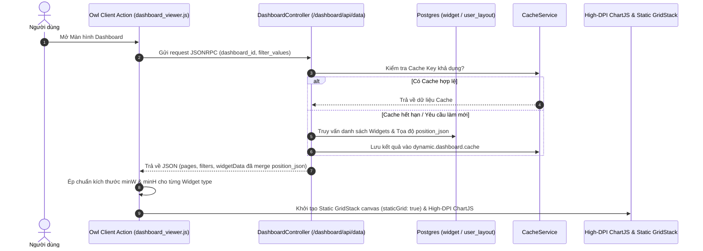
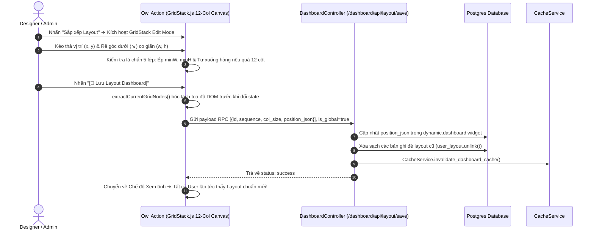

# Universal Dynamic Dashboard Builder (`aidt_dashboard_builder`)
> **Phân hệ Dashboard Động No-Code & GridStack Drag-and-Drop Chuyên Nghiệp Cho Odoo 19 (Enterprise Edition)**

---

## 📌 1. BẢNG TỔNG QUAN HỆ THỐNG

| Hạng mục | Chi tiết kỹ thuật |
| :--- | :--- |
| **Module Name** | `aidt_dashboard_builder` |
| **Phiên bản Odoo** | **Odoo 19.0+** (Tương thích OWL 2 Framework) |
| **Phụ thuộc (Depends)** | `base`, `web`, `hr`, `mail` |
| **Giấy phép (License)** | LGPL-3 |
| **Công nghệ Frontend** | Odoo OWL 2, GridStack.js v10 (12-Col Free Canvas & 2D Resizing), Chart.js v4 (High-DPI Retina Engine), Canvas 2D Fallback Engine, Bootstrap 5, SCSS |
| **Công nghệ Backend** | Odoo 19 ORM, JSONRPC API, Dynamic Domain Compiler, Security Whitelist Engine, Cache Invalidation Engine |
| **Tiêu chuẩn Code** | Clean Code, Enterprise Architecture, 100% Files < 500 Dòng code, Không N+1 Queries, Bảo mật 2026 |

---

## 🚀 2. CÁC TÍNH NĂNG NỔI BẬT

1. **No-Code Visual Query Builder (Bộ dựng truy vấn không gõ code)**:
   * Chọn trực tiếp Model, Trường Gom nhóm (GroupBy), Trường Tính chỉ số (Measure) và Cột hiển thị bằng Dropdown chuẩn Odoo.
   * Tự động nhận diện kiểu dữ liệu: Phân biệt chính xác giữa trường liên kết Many2one và trường Ngày tháng (`Date`/`Datetime`).

2. **Lưới Kéo Thả 12 Cột Tự Do (GridStack.js 12-Column Free Canvas & Resizing)**:
   * **Nút "Sắp xếp Layout"**: Chuyển đổi linh hoạt giữa Chế độ Xem tĩnh (`staticGrid: true`) và Chế độ Chỉnh sửa Designer (`staticGrid: false`).
   * **Drag & Drop Tự Do 12 Cột**: Nắm giữ thanh công cụ tiêu đề để di chuyển Widget đến bất kỳ vị trí `(x, y)` nào trên lưới 12 cột.
   * **Tay Nắm Co Giãn 2 Chiều (2D Corner Resize Handle `↘`)**: Rê chuột vào góc dưới bên phải Widget để co giãn độ rộng (`w`: 3-12) và chiều cao (`h`: 2-12) tùy ý.
   * **Giao diện Tối giản Siêu Gọn**: Đã loại bỏ hoàn toàn các nút bấm điều hướng dư thừa, mang lại trải nghiệm kéo thả tự nhiên nhất.

3. **Nút Lưu Layout Chung Cho Toàn Bộ Hệ Thống (`[💾 Lưu Layout Dashboard]`)**:
   * **1 Nút Lưu Duy Nhất**: Áp dụng vị trí & kích thước mới làm chuẩn chung cho **tất cả người dùng** trong tổ chức.
   * **Tự Động Làm Sạch Đè Layout Cá Nhân**: Tự động dọn dẹp các bản ghi đè layout cũ (`unlink()`) và giải phóng bộ nhớ đệm Cache để 100% User lập tức nhìn thấy giao diện chuẩn mới.

4. **Lớp Đồ Họa Siêu Sắc Nét (High-DPI Retina Graphic Engine)**:
   * **Tỷ lệ Mật độ Điểm ảnh HD (`devicePixelRatio`)**: Tự động điều chỉnh độ phân giải canvas gấp 2 - 3 lần trên màn hình Windows / Mac Retina.
   * **Lắng nghe Co giãn Cửa sổ (`ResizeObserver`)**: Tự động redraw biểu đồ khi thu phóng hoặc chuyển đổi chế độ xem, đảm bảo biểu đồ **luôn luôn sắc nét 100%, không bao giờ bị mờ hay vỡ nét**.

5. **Lớp Bảo Vệ Chống Co Rút Layout 5 Tầng (5-Layer Layout Protection System)**:
   * **Lớp 1 - Chống Va Chạm Hàng (`Row-End Collision Wrapping`)**: Tự động đẩy Widget xuống hàng dưới khi kéo quá biên 12 cột chứ không co bóp chiều rộng.
   * **Lớp 2 - Chống Rút 1 Cột (`disableOneColumnMode: true`)**: Ngăn GridStack tự bóp nhỏ thành 1 cột dọc.
   * **Lớp 3 - Ép Đồng Bộ DOM (`gridStackInstance.update`)**: Phát lệnh cập nhật DOM tức thì khi có biến động vị trí.
   * **Lớp 4 - Bảo Vệ Nạp Dữ Liệu (`Boundary Clamping`)**: Tự cân chỉnh tọa độ `x` khi load dữ liệu DB.
   * **Lớp 5 - Lá Chắn CSS (`.grid-stack-item { min-width: 160px !important; }`)**: Đảm bảo không ô nào bị bóp nhỏ dưới 160px.

6. **Hỗ trợ 10 loại Widget Đồ họa**:
   * **Thẻ KPI (KPI Card)**: Đếm số lượng, Tính tổng (Sum), Trung bình (Average), Nhỏ nhất (Min), Lớn nhất (Max) với chống tràn chữ `text-truncate`.
   * **6 loại Biểu đồ (Charts)**: Biểu đồ Cột (Bar), Thanh ngang (Horizontal Bar), Đường (Line), Miền (Area), Tròn (Pie), Donut.
   * **Bảng Dữ liệu (Table)**: Phân trang bản ghi, giới hạn hiển thị (Limit) và nút bấm **Xem tất cả**.
   * **Phím tắt & Hoạt động (Shortcut & Activity)**: Truy cập nhanh và theo dõi nhật ký hoạt động.

7. **Kiến trúc Phân quyền Bảo mật 3 Lớp (3-Tier Security Architecture)**:
   * **Cấp độ Hệ thống (ACL)**: Phân biệt rõ giữa *Người dùng Dashboard* (`group_dashboard_user`), *Nhà thiết kế* (`group_dashboard_designer`) và *Quản trị Dashboard* (`group_dashboard_manager`).
   * **Cấp độ Dashboard (Sharing Rules)**: Phân quyền theo Trạng thái, Người xem chỉ định (`viewer_ids`), Nhóm quyền (`group_ids`) và Công ty (`company_ids`).
   * **Cấp độ Bản ghi (Row-Level Security)**: Truy vấn ORM chạy dưới danh nghĩa tài khoản đang đăng nhập (`env.user`).

---

## 🏗️ 3. KIẾN TRÚC THƯ MỤC VÀ FILE CẤU TRÚC

```text
aidt_dashboard_builder/
├── __manifest__.py                 # Khai báo dependencies, data XML và web.assets_backend
├── security/
│   ├── dashboard_groups.xml        # Định nghĩa Nhóm quyền User / Designer / Manager
│   ├── dashboard_rules.xml         # Định nghĩa Record Rules phân quyền truy cập
│   └── ir.model.access.csv         # Phân quyền CRUD trên các Models của Dashboard
├── data/
│   ├── dashboard_cron.xml          # Cron Job tự động làm sạch Cache dữ liệu
│   └── dashboard_templates.xml     # Templates mẫu khởi tạo mặc định
├── models/
│   ├── dashboard.py                # Model dynamic.dashboard (Quản lý Dashboard & Phân quyền)
│   ├── dashboard_page.py           # Model dynamic.dashboard.page (Trang / Tabs Navigation)
│   ├── dashboard_widget.py         # Model dynamic.dashboard.widget (Cấu hình Widget & Layout pos)
│   ├── dashboard_user_layout.py    # Model dynamic.dashboard.user.layout (Lưu Layout cá nhân hóa per-user)
│   ├── dashboard_filter.py         # Model dynamic.dashboard.filter (Bộ lọc dùng chung)
│   └── dashboard_cache.py          # Model dynamic.dashboard.cache (Bộ nhớ đệm hiệu năng cao)
├── services/
│   ├── query_engine.py             # Động cơ thực thi truy vấn ORM safe (_read_group, search_read)
│   ├── query_validator.py          # Động cơ kiểm duyệt danh sách trắng (Whitelist Validation)
│   ├── domain_compiler.py          # Biên dịch bộ lọc JSON sang Odoo Domain
│   ├── metadata_service.py        # Lấy danh sách Models & Fields cho No-code UI
│   └── cache_service.py           # Quản lý tạo Key Cache & Invalidation Engine
├── providers/
│   ├── base_provider.py            # Abstract Base Class cho Data Providers
│   ├── odoo_provider.py            # Provider lấy dữ liệu từ Odoo ORM Models
│   ├── static_provider.py          # Provider cho dữ liệu tĩnh / Phím tắt
│   └── provider_registry.py        # Registry đăng ký các Data Providers
├── controllers/
│   └── dashboard_controller.py     # JSONRPC API (/dashboard/api/list, /data, /layout/save, /layout/reset)
├── static/
│   └── src/
│       ├── actions/
│       │   ├── dashboard_viewer.js # Owl Client Action chính (Quản lý GridStack 12-Col Engine & Boundaries)
│       │   └── dashboard_viewer.xml# Template XML cho Header, Tabs Bar, Edit Canvas & View Canvas
│       ├── services/
│       │   └── widget_registry.js  # Registry đăng ký Widget Frontend
│       ├── style/
│       │   └── dashboard.scss      # SCSS Design Tokens & Resizing Handles Styling
│       └── widgets/
│           ├── kpi/ (kpi_widget.js, kpi_widget.xml)
│           ├── chart/ (chart_widget.js, chart_widget.xml - High-DPI ResizeObserver)
│           ├── table/ (table_widget.js, table_widget.xml)
│           ├── activity/ (activity_widget.js, activity_widget.xml)
│           └── shortcut/ (shortcut_widget.js, shortcut_widget.xml)
└── README.md                       # Tài liệu hướng dẫn sử dụng và kiến trúc chi tiết
```

---

## 🔄 4. LUỒNG XỬ LÝ DỮ LIỆU & LAYOUT PIPELINE

### 🔹 Luồng 1: Tải và Hiển thị Dashboard theo Layout Chuẩn


### 🔹 Luồng 2: Kéo Thả 12 Cột & Lưu Layout Dashboard Toàn Cục


---

## 📖 5. HƯỚNG DẪN SỬ DỤNG CHO NGƯỜI DÙNG

### Bước 1: Tạo Dashboard Mới
1. Truy cập menu **Dashboard Builder** ➔ Chọn **Danh sách Dashboards**.
2. Nhấn nút **Tạo mới (New)**, nhập tên Dashboard (Ví dụ: *Dashboard Quản lý Văn bản*).
3. Tại tab **Phân quyền & Chia sẻ**, thiết lập trạng thái là `Đã xuất bản (Published)` và chọn các nhóm quyền được phép xem.

### Bước 2: Tạo Widget bằng No-Code Builder
1. Chuyển sang menu **Cấu hình Widgets** ➔ Nhấn **Tạo mới**.
2. **Cấu hình cơ bản**: Nhập tên Widget, chọn Dashboard thuộc về, và loại Widget (Thẻ KPI, Biểu đồ Cột, Bảng dữ liệu...).
3. **Cấu hình Dữ liệu Trực quan (No-code)**: Chọn Model Odoo, Trường gom nhóm, và Phép tính chỉ số.
4. Nhấn **Lưu**.

### Bước 3: Thiết Kế Layout 12 Cột Tự Do & Lưu Cho Toàn Bộ User
1. Mở màn hình **Dashboard**.
2. Nhấn nút **"Sắp xếp Layout"** ở thanh công cụ góc trên bên phải.
3. **Kéo thả di chuyển**: Nắm vào thanh tiêu đề của Widget để kéo đến vị trí mong muốn trên lưới 12 cột.
4. **Co giãn 2 chiều**: Rê chuột vào **icon màu tím `↘` ở góc dưới bên phải Widget** và kéo thả để điều chỉnh độ rộng/chiều cao.
5. Nhấn **`[💾 Lưu Layout Dashboard]`** ➔ Toàn bộ người dùng trong hệ thống sẽ thấy giao diện mới sắc nét và chuẩn xác 100%!
