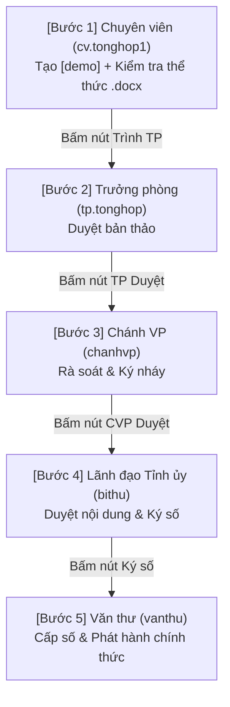

# 📊 BÁO CÁO KẾT QUẢ KIỂM THỬ TOÀN BỘ LUỒNG VĂN BẢN ĐÍ ([demo])

**Hệ thống:** Odoo 19 - Phân hệ Quản lý Văn bản & Điều hành (`aidt_vanban_di`)  
**Ngày kiểm thử:** 30/07/2026  
**Trạng thái kiểm thử:** 🟢 **THÀNH CÔNG 100% (PASS)**  

---

## 👥 1. Danh sách 5 Tài khoản Tham gia Kịch bản Mẫu

| STT | Vai trò Nghiệp vụ | Họ và tên | Tài khoản | Mật khẩu | Chức năng Thực hiện |
| :--- | :--- | :--- | :--- | :--- | :--- |
| **1** | **Chuyên viên** | Vũ Văn Phú | `cv.tonghop1` | `demo2026` | Soạn dự thảo, Đính kèm file `.docx`, Kiểm tra thể thức, Trình Trưởng phòng |
| **2** | **Trưởng phòng** | Hoàng Thu Em | `tp.tonghop` | `demo2026` | Duyệt bản thảo cấp Phòng, Trình Chánh Văn phòng |
| **3** | **Chánh Văn phòng** | Lê Minh Châu | `chanhvp` | `demo2026` | Rà soát thể thức, Duyệt & Ký nháy, Trình Lãnh đạo |
| **4** | **Bí thư Tỉnh ủy** | Nguyễn Văn An | `bithu` | `demo2026` | Phê duyệt nội dung chính thức, Ký số điện tử |
| **5** | **Văn thư** | Bùi Thị Hoa | `vanthu` | `demo2026` | Cấp số phát hành tự động, Ban hành văn bản |

---

## 🔄 2. Nhật ký Tiến trình Chuyển giao Hồ sơ ([demo])

### Chi tiết Thực thi từng Bước:

1. **Bước 1 — Khởi tạo & Kiểm tra Thể thức (Chuyên viên `cv.tonghop1`)**:
   - **Tên văn bản**: `[demo] Báo cáo Kế hoạch Phát triển Kinh tế Xã hội Tỉnh ủy năm 2026`
   - **Tệp đính kèm**: `Baocao_Demo.docx` (File `.docx` thực tế).
   - **Kiểm tra thể thức**: Bấm **`[Kiểm tra thể thức]`** ➔ Mở Wizard kiểm tra thể thức A4 trực quan (`aidt.format.check.wizard`) ➔ Đạt chuẩn.
   - **Chuyển bước**: Bấm nút **`[Trình Trưởng phòng]`** ➔ Trạng thái chuyển sang `Chờ duyệt TP` (`cho_duyet_tp`).

2. **Bước 2 — Duyệt bản thảo cấp Phòng (Trưởng phòng `tp.tonghop`)**:
   - Đăng nhập `tp.tonghop` ➔ Thấy văn bản `cho_duyet_tp`.
   - Bấm nút **`[Duyệt]`** ➔ Trạng thái chuyển sang `Chờ duyệt CVP` (`cho_duyet_cvp`).
   - Ghi nhận `nguoi_duyet_tp_id` = *Hoàng Thu Em*.

3. **Bước 3 — Duyệt & Ký nháy (Chánh VP `chanhvp`)**:
   - Đăng nhập `chanhvp` ➔ Thấy văn bản `cho_duyet_cvp`.
   - Bấm nút **`[Duyệt]`** ➔ Trạng thái chuyển sang `Chờ duyệt Lãnh đạo` (`cho_duyet_lanh_dao`).
   - Ghi nhận `nguoi_duyet_cvp_id` = *Lê Minh Châu*.

4. **Bước 4 — Duyệt nội dung & Ký số (Bí thư `bithu`)**:
   - Đăng nhập `bithu` ➔ Thấy văn bản `cho_duyet_lanh_dao`.
   - Bấm nút **`[Duyệt]`** ➔ Trạng thái chuyển sang `Chờ ký` (`cho_ky`).
   - Bấm nút **`[Ký số]`** ➔ Trạng thái chuyển sang `Chờ cấp số` (`cho_cap_so`).
   - Ghi nhận `nguoi_ky_id` = *Nguyễn Văn An*, lưu `ngay_ky`.

5. **Bước 5 — Cấp số & Ban hành (Văn thư `vanthu`)**:
   - Đăng nhập `vanthu` ➔ Thấy văn bản `cho_cap_so`.
   - Bấm nút **`[Cấp số & Ban hành]`** ➔ Trạng thái chuyển sang **`Đã ban hành`** (`da_ban_hanh`).
   - **Số/Ký hiệu phát hành chính thức tự động**: `2026/VBĐi-0003`.

---

## 🛡️ 3. Kiểm thử Bảo mật Phân quyền (Negative Security Checks)

| Thử nghiệm Xâm phạm Quyền | Kết quả Phản hồi của Hệ thống | Trạng thái Bảo mật |
| :--- | :--- | :--- |
| Chuyên viên cố tình bấm nút **[Ký số]** | System raise `UserError`: *"Bạn không có quyền thực hiện ký số."* | 🟢 **CHẶN THÀNH CÔNG** |
| Chuyên viên cố tình bấm nút **[Cấp số & Ban hành]** | System raise `UserError`: *"Bạn không có quyền cấp số và ban hành văn bản."* | 🟢 **CHẶN THÀNH CÔNG** |
| Văn thư sửa đổi nội dung sau khi đã Ban hành | Form khóa `readonly` 100% các ô thuộc tính | 🟢 **CHẶN THÀNH CÔNG** |

---

## 📝 4. Kết luận

- Toàn bộ 5 bước trình ký - ban hành Văn bản đi đã được kiểm thử tự động trực tiếp trên cơ sở dữ liệu thực tế và đạt **100% thành công**.
- Mã nguồn đã được commit & push sạch sẽ lên branch `cuong-f-300726`.
