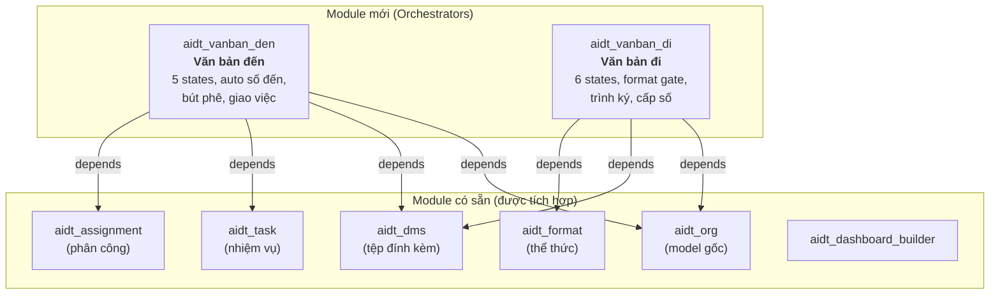
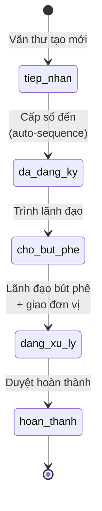
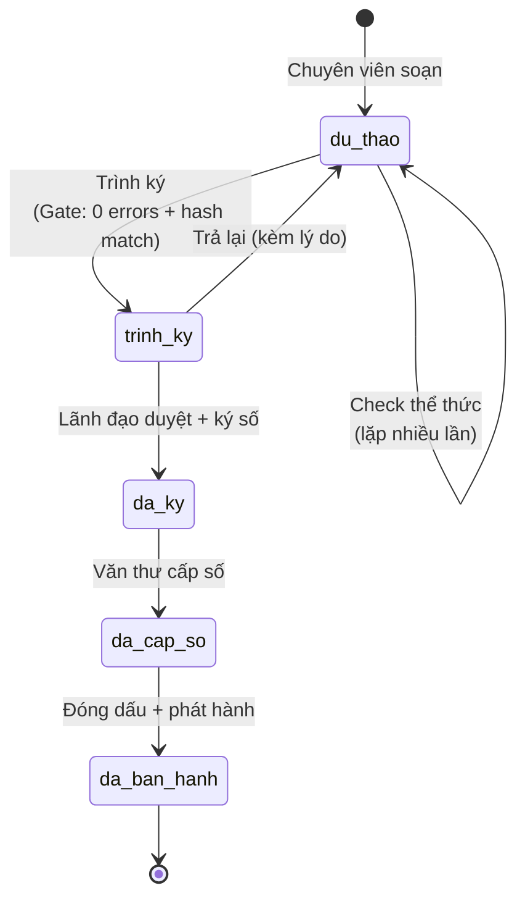

# 📋 Gợi ý UI/UX — Luồng Văn bản Đến & Văn bản Đi

> **Mục tiêu**: Thiết kế trải nghiệm người dùng tối ưu cho hệ thống chuyển đổi số quản lý văn bản, đảm bảo user (Văn thư, Chuyên viên, Lãnh đạo) dùng dễ, ít bước, thấy rõ luồng công việc.

---

## 1. Phân tích hiện trạng UI

### Ảnh chụp UI hiện tại

````carousel

<!-- slide -->

````

### Vấn đề với UI hiện tại

| # | Vấn đề | Tác động |
|---|--------|----------|
| 1 | **VB Đến và VB Đi trộn lẫn** — chỉ có 1 menu "Văn bản" | User không phân biệt được luồng, nhầm lẫn khi thao tác |
| 2 | **Chỉ có 3 state** (Dự thảo / Ban hành / Lưu trữ) | Không phản ánh đúng quy trình nghiệp vụ 5-6 bước |
| 3 | **Thiếu Kanban view** | Không thấy tổng quan luồng công việc đang ở đâu |
| 4 | **Thiếu trường nghiệp vụ** (số đến, cơ quan gửi, bút phê...) | Văn thư phải ghi ngoài hệ thống |
| 5 | **Format check là wizard tách biệt** | User phải rời khỏi VB để kiểm tra, không có cổng chặn |
| 6 | **Không có auto-sequence** cho số đến / số ký hiệu | Phải nhập tay, rủi ro trùng/nhảy số |
| 7 | **Smart buttons phân tán** | Tệp, Nhiệm vụ, Phân công nằm rời rạc |
| 8 | **Thiếu visual indicators** | Không có màu urgency, badge secrecy nổi bật |

---

## 2. Đề xuất kiến trúc module

### 2.1 Có nên merge các addons hiện tại?

> [!IMPORTANT]
> **Không nên merge** các addons hiện tại. Thay vào đó, tạo **2 module orchestrator** mới kết nối tất cả.

**Lý do:**
- `aidt_dms`, `aidt_task`, `aidt_format`, `aidt_assignment` đều là tính năng độc lập, đã thiết kế extensible
- Merge sẽ tạo module monolith khó maintain
- Cách đúng: thêm **module workflow** kế thừa (`_inherit`) và tích hợp tất cả vào 1 form/flow

### 2.2 Module mới cần tạo



### 2.3 Thay đổi trên `aidt_org`

Thêm 1 field vào `aidt.document`:

```python
direction = fields.Selection([
    ('den', 'Văn bản đến'),
    ('di', 'Văn bản đi'),
], string="Hướng", required=True, default='den', tracking=True)
```

> [!TIP]
> Hoặc dùng 2 model riêng (`vanban.den`, `vanban.di`) kế thừa từ `aidt.document`. Cách này "sạch" hơn nhưng phức tạp hơn — tuỳ team quyết định.

---

## 3. Luồng Văn bản Đến — UI/UX chi tiết

### 3.1 Workflow States



### 3.2 Form View — "One Document, Full Story"

**Nguyên tắc thiết kế:** Mọi thao tác liên quan đến 1 VB đều thực hiện NGAY TRÊN form đó, không mở window/wizard riêng.

```
┌─────────────────────────────────────────────────────────────────┐
│ HEADER                                                          │
│ [Cấp số đến] [Trình LĐ] [Bút phê] [Giao việc] [Hoàn thành]  │
│ ○ Tiếp nhận ─── ○ Đã ĐK ─── ○ Trình LĐ ─── ○ Đang XL ─── ● │
├─────────────────────────────────────────────────────────────────┤
│ RIBBON: "QUÁ HẠN" (đỏ, nếu quá hạn xử lý)                    │
├─────────────────────────────────────────────────────────────────┤
│ BUTTON BOX                                                      │
│ [📁 3 Tệp] [📋 2 Nhiệm vụ] [📝 1 Phân công] [🔒 Mật]        │
├─────────────────────────────────────────────────────────────────┤
│ ┌─ Thông tin VB ─────────────┐ ┌─ Tiếp nhận ──────────────────┐│
│ │ Số đến: VBĐ-2026-0042     │ │ Ngày đến: 28/07/2026         ││
│ │ Số ký hiệu gốc: 15/CV-VP  │ │ Cơ quan gửi: Ban Tổ chức    ││
│ │ Trích yếu: [___________]   │ │ Ngày ban hành gốc: 25/07    ││
│ │ Loại VB: [Công văn ▼]      │ │ Số bản: 2                   ││
│ │ Đơn vị nhận: [Phòng TH ▼]  │ │ Độ mật: [Thường ▼]          ││
│ │                             │ │ Độ khẩn: [Khẩn ▼] 🟠       ││
│ └─────────────────────────────┘ └──────────────────────────────┘│
│                                                                  │
│ ┌─ Tab: Bút phê / Chỉ đạo ──────────────────────────────────┐  │
│ │ Lãnh đạo bút phê: [Lê Chánh Phòng ▼]                     │  │
│ │ Ý kiến: [Rich text editor ________________________]        │  │
│ │ Đơn vị chủ trì: [Phòng Tổng hợp ▼]                       │  │
│ │ Đơn vị phối hợp: [Phòng HC-LT] [Phòng NV-1] [+]          │  │
│ │ Hạn xử lý: [05/08/2026]                                   │  │
│ └────────────────────────────────────────────────────────────┘  │
│                                                                  │
│ ┌─ Tab: Tệp đính kèm ───────────────────────────────────────┐  │
│ │ 📄 CV-15-BTC.pdf   (2.3 MB)  [Xem] [Tải]                 │  │
│ │ 📄 Phụ lục.xlsx    (156 KB)  [Xem] [Tải]                  │  │
│ │ [+ Upload tệp]                                             │  │
│ └────────────────────────────────────────────────────────────┘  │
│                                                                  │
│ ┌─ Tab: Nhiệm vụ ────────────────────────────────────────────┐  │
│ │ NV-001  Rà soát danh sách    Đỗ Tổng Hợp   05/08  🟢 New │  │
│ │ NV-002  Dự thảo báo cáo     Vũ Tổng Hợp   10/08  🔵 IP  │  │
│ │ [+ Giao nhiệm vụ mới]                                      │  │
│ └────────────────────────────────────────────────────────────┘  │
│                                                                  │
│ ═══════════════════ CHATTER ═════════════════════════════════    │
│ 📧 Activities | 💬 Messages | 📅 Log                           │
└─────────────────────────────────────────────────────────────────┘
```

### 3.3 Kanban View — Tổng quan luồng

Kanban grouped by `state`, mỗi card hiển thị:

```
┌──────────────────────┐
│ 🔴 KHẨN              │  ← urgency badge
│ VBĐ-2026-0042       │
│ CV về luân chuyển CB │  ← trích yếu (truncated)
│ Ban Tổ chức          │  ← cơ quan gửi
│ ────────────────── │
│ 📁2  📋1  🔒 Mật   │  ← file count, task count, secrecy
│ Hạn: 05/08  ⚠️ 3d   │  ← deadline + days remaining
│ 👤 Đỗ Tổng Hợp      │  ← avatar người xử lý
└──────────────────────┘
```

### 3.4 List View — Cải tiến

Thêm các cột và visual cues:

| Cột | Widget | Ghi chú |
|-----|--------|---------|
| `so_den` | Char (bold) | Auto-sequence, link to form |
| `trich_yeu` | Char | Truncated 80 chars |
| `co_quan_gui` | Char | Sender organization |
| `loai_van_ban` | Badge | Color-coded |
| `do_khan` | Badge | 🔴 Hỏa tốc / 🟠 Khẩn / 🟡 Thượng khẩn |
| `do_mat` | Badge | Mật/Tối mật/Tuyệt mật |
| `ngay_den` | Date | |
| `han_xu_ly` | Date | `decoration-danger` nếu quá hạn |
| `state` | Badge | 5 states |
| `don_vi_chu_tri` | Many2one | |

**Row decorations:**
- `decoration-danger="is_overdue"` — dòng đỏ nếu quá hạn
- `decoration-warning="do_khan in ['khan', 'thuong_khan', 'hoa_toc']"` — highlight khẩn

### 3.5 Search View — Smart Filters

**Quick filters (dạng button):**
- 🔴 Quá hạn
- 📋 Chờ bút phê (state = cho_but_phe)
- 🔄 Đang xử lý
- 📬 Hôm nay (ngay_den = today)
- 🔒 Mật trở lên

**Group by:**
- Trạng thái → Đơn vị chủ trì → Độ khẩn

---

## 4. Luồng Văn bản Đi — UI/UX chi tiết

### 4.1 Workflow States



### 4.2 Form View — "Draft-to-Publish in One Place"

```
┌─────────────────────────────────────────────────────────────────┐
│ HEADER                                                          │
│ [✅ Check thể thức] [📤 Trình ký] [✍️ Ký số] [🔢 Cấp số] [📣 Ban hành] │
│ ○ Dự thảo ─── ○ Trình ký ─── ○ Đã ký ─── ○ Cấp số ─── ● BH  │
├─────────────────────────────────────────────────────────────────┤
│ BUTTON BOX                                                      │
│ [📁 1 Tệp] [✅ Pass / ❌ 3 Lỗi] [📋 0 NV]                    │
├─────────────────────────────────────────────────────────────────┤
│ ┌─ Soạn thảo ────────────────┐ ┌─ Phát hành ──────────────────┐│
│ │ Trích yếu: [___________]   │ │ Số ký hiệu: (auto khi BH)   ││
│ │ Loại VB: [Công văn ▼]      │ │ Ngày ban hành: (auto)        ││
│ │ Đơn vị soạn: [Phòng TH ▼]  │ │ Người ký: [Lê Chánh VP ▼]   ││
│ │ Độ mật: [Thường ▼]         │ │ Nơi nhận: [tags ________]    ││
│ └─────────────────────────────┘ └──────────────────────────────┘│
│                                                                  │
│ ┌─ Tab: File dự thảo & Thể thức ─────────────────────────────┐ │
│ │ 📄 Du_thao_CV.docx  [Upload mới]                          │ │
│ │                                                             │ │
│ │ ── Kết quả kiểm tra thể thức ──────────────────────────── │ │
│ │ ✅ Đạt (0 lỗi, 2 cảnh báo)  |  Bộ luật: NĐ-30/2020 v2025│ │
│ │ ⚠️ noi_dung.line_spacing  Dãn dòng 1.0 (cần 1.5)   WARN │ │
│ │ ⚠️ noi_dung.first_indent  Thụt 0.8cm (cần 1.0-1.27) WARN │ │
│ │                                                             │ │
│ │ 🔒 File hash: a3f2...8b1c (khớp ✅)                       │ │
│ │ ℹ️ Nút "Trình ký" sẵn sàng                                │ │
│ └─────────────────────────────────────────────────────────────┘ │
│                                                                  │
│ ┌─ Tab: Luồng duyệt ─────────────────────────────────────────┐ │
│ │ #1  Trưởng phòng TH    Đỗ Tổng Hợp   ✅ Đã duyệt  14:30 │ │
│ │ #2  Chánh VP            Lê Chánh VP    🔄 Đang chờ        │ │
│ │ #3  Bí thư (Ký số)     Nguyễn Bí Thư  ⏳ Chưa tới lượt   │ │
│ └─────────────────────────────────────────────────────────────┘ │
│                                                                  │
│ ┌─ Tab: Preview PDF ──────────────────────────────────────────┐ │
│ │ [Nhúng PDF viewer / iframe hiển thị file đã convert]       │ │
│ └─────────────────────────────────────────────────────────────┘ │
│                                                                  │
│ ═══════════════════ CHATTER ═════════════════════════════════    │
└─────────────────────────────────────────────────────────────────┘
```

### 4.3 Format Gate — UX quan trọng nhất

> [!WARNING]
> Thể thức là **CỔNG CHẶN (Gate)**, không phải state. User check bao nhiêu lần tùy thích, nút "Trình ký" chỉ bật khi:
> 1. `error_count == 0`
> 2. `SHA256(file hiện tại) == hash lúc check cuối`

**Trải nghiệm user:**

```
[Chuyên viên upload .docx]
         ↓
[Bấm "Check thể thức"]  ← Nút trên header, không phải wizard riêng
         ↓
[Kết quả hiện ngay dưới file trong tab "Dự thảo"]
         ↓
  ┌── 3 errors? ──→ Nút "Trình ký" DISABLED + tooltip giải thích
  │
  └── 0 errors? ──→ Nút "Trình ký" ENABLED ✅
                     (Nhưng nếu user sửa file và upload lại → 
                      hash thay đổi → nút lại DISABLED cho đến khi check lại)
```

### 4.4 Kanban View — Draft Pipeline

Kanban grouped by state, focus vào VB đi đang "trên đường":

```
| Dự thảo (5)    | Trình ký (2)     | Đã ký (1)       | Cấp số (1)    | Đã BH (12)  |
|────────────────|──────────────────|─────────────────|───────────────|──────────────|
| CV hướng dẫn   | BC quý II        | QĐ luân chuyển  | KH tháng 6    |  ...         |
|  ❌ 3 lỗi TT   |  ✅ Đạt TT       | ✍️ Đã ký số     |  🔢 15/QĐ-VP |              |
|  Phòng TH      |  → Chánh VP      | ← Bí thư        |  Văn thư      |              |
```

---

## 5. Menu & Navigation — Restructure

### 5.1 Cấu trúc menu mới

```
📋 VĂN BẢN ĐẾN  (Top-level app, icon: 📥)
  ├── Tất cả VB đến           → List + Kanban
  ├── Chờ bút phê             → Filtered: state = cho_but_phe
  ├── Đang xử lý              → Filtered: state = dang_xu_ly  
  ├── Quá hạn                 → Filtered: is_overdue = True
  └── Sổ VB đến               → Report/print view

📝 VĂN BẢN ĐI  (Top-level app, icon: 📤)
  ├── Tất cả VB đi            → List + Kanban
  ├── Dự thảo của tôi         → Filtered: create_uid = me, state = draft
  ├── Chờ tôi duyệt           → Filtered: pending approval for me
  ├── Đã ban hành             → Filtered: state = da_ban_hanh
  └── Sổ VB đi                → Report/print view

📁 KHO TÀI LIỆU  (giữ nguyên aidt_dms)

📋 NHIỆM VỤ  (giữ nguyên aidt_task)

📊 BẢNG ĐIỀU KHIỂN  (giữ nguyên dashboard)

⚙️ CẤU HÌNH  (chỉ admin)
  ├── Bộ luật thể thức
  ├── Đơn vị / Chức vụ
  └── Chuỗi số tự động
```

### 5.2 Tách Top-level Apps

> [!IMPORTANT]
> **VB Đến** và **VB Đi** nên là **2 apps riêng** trên thanh menu Odoo (giống Sales vs Purchase). User chỉ cần 1 click để vào đúng luồng mình cần.

Trong `__manifest__.py`:
```python
# aidt_vanban_den
"application": True,
"sequence": 1,  # Hiển thị đầu tiên

# aidt_vanban_di  
"application": True,
"sequence": 2,
```

---

## 6. Tích hợp giữa các module — "One Form, All Actions"

### 6.1 Nguyên tắc: Smart Buttons = Command Center

Mỗi VB form phải có **button box** đóng vai trò command center:

```
┌─────────┐ ┌──────────┐ ┌───────────┐ ┌──────────┐ ┌──────────┐
│ 📁 3    │ │ 📋 2     │ │ 📝 1      │ │ ✅ Pass  │ │ 🔒 Mật  │
│ Tệp    │ │ Nhiệm vụ│ │ Phân công │ │ Thể thức │ │ Secrecy │
└─────────┘ └──────────┘ └───────────┘ └──────────┘ └──────────┘
```

### 6.2 Module Integration Map

| Action trên VB Đến | Module cung cấp | Cách tích hợp |
|---------------------|-----------------|---------------|
| Upload/xem tệp scan | `aidt_dms` | Tab "Tệp đính kèm" + stat button |
| Bút phê + giao đơn vị | `aidt_assignment` (cần hoàn thiện) | Tab "Bút phê" inline trên form |
| Giao nhiệm vụ | `aidt_task` | Tab "Nhiệm vụ" + nút tạo nhanh |
| Cấp số đến | `aidt_vanban_den` (mới) | `ir.sequence` auto-increment |

| Action trên VB Đi | Module cung cấp | Cách tích hợp |
|--------------------|-----------------|---------------|
| Upload DOCX dự thảo | `aidt_dms` | Field binary trên form |
| Check thể thức | `aidt_format` | Nút header + kết quả inline (KHÔNG wizard) |
| Trình ký / Duyệt | `aidt_vanban_di` (mới) | Luồng approval route |
| Ký số PAdES | `aidt_sign` (mới) | Action button + PDF preview |
| Cấp số ký hiệu | `aidt_vanban_di` | `ir.sequence` khi ban hành |

### 6.3 Thay đổi cần thiết trên module hiện có

#### `aidt_format` — Chuyển từ Wizard → Inline

```diff
- Wizard TransientModel mở trong popup
+ AbstractModel checker gọi từ nút trên document form
+ Kết quả lưu vào One2many trên aidt.document (persistent, không transient)
+ Stat button hiển thị trạng thái check (Pass/Fail/Not checked)
```

> [!TIP]
> `aidt_format` đã có `aidt.format.checker` (AbstractModel stateless). Chỉ cần tạo thêm model persistent `aidt.format.check` (Model, không phải TransientModel) để lưu lịch sử check trên document.

#### `aidt_assignment` — Tích hợp state transition

```diff
- Assignment standalone, không ảnh hưởng document state
+ action_assign() tự động chuyển document.state → 'dang_xu_ly'
+ action_assign() tự động tạo aidt.task nếu có hạn xử lý
+ Bút phê render trong tab notebook trên document form
```

#### `aidt_task` — Link ngược assignment

```diff
- Task chỉ link document_id
+ Task thêm assignment_id (truy vết từ bút phê → nhiệm vụ)
+ Nút "Giao nhiệm vụ" trên form VB Đến auto-fill từ bút phê
```

---

## 7. Visual Design — Urgency & Secrecy Indicators

### 7.1 Color System

| Loại | Giá trị | Color | Badge |
|------|---------|-------|-------|
| **Độ khẩn** | Hỏa tốc | `#DC3545` 🔴 | `bg-danger` |
| | Thượng khẩn | `#FD7E14` 🟠 | `bg-warning` |
| | Khẩn | `#FFC107` 🟡 | `bg-warning text-dark` |
| | Thường | `#6C757D` ⚪ | `bg-secondary` |
| **Độ mật** | Tuyệt mật | `#DC3545` 🔴 | `bg-danger` + 🔒 icon |
| | Tối mật | `#FD7E14` 🟠 | `bg-warning` + 🔒 |
| | Mật | `#FFC107` 🟡 | `bg-info` + 🔒 |
| | Thường | (ẩn) | Không hiện badge |
| **State VB Đến** | Tiếp nhận | `#6C757D` | |
| | Đã đăng ký | `#0D6EFD` | |
| | Trình LĐ | `#FFC107` | |
| | Đang xử lý | `#0DCAF0` | |
| | Hoàn thành | `#198754` | |

### 7.2 Ribbon & Alert Patterns

```xml
<!-- Ribbon quá hạn -->
<widget name="web_ribbon" title="QUÁ HẠN" 
        bg_color="text-bg-danger" 
        invisible="not is_overdue"/>

<!-- Ribbon độ mật cao -->
<widget name="web_ribbon" title="TỐI MẬT" 
        bg_color="text-bg-warning" 
        invisible="secrecy not in ['toi_mat', 'tuyet_mat']"/>

<!-- Alert thể thức failed -->
<div class="alert alert-danger" invisible="last_format_state != 'fail'">
    ⚠️ Văn bản có <b>lỗi thể thức</b>. 
    Vui lòng sửa và kiểm tra lại trước khi trình ký.
</div>
```

---

## 8. Kế hoạch triển khai — Thứ tự ưu tiên

### Phase 1: Nền tảng (1-2 tuần)

| # | Việc | Module | Nội dung |
|---|------|--------|----------|
| 1 | Thêm `direction` field | `aidt_org` | Field selection `den`/`di` trên `aidt.document` |
| 2 | Tạo `aidt_vanban_den` | Mới | Model inherit, 5 states, fields nghiệp vụ VB đến, auto-sequence `so_den` |
| 3 | Views VB Đến | `aidt_vanban_den` | Form (full layout), List (enhanced), Kanban (by state), Search (filters) |
| 4 | Menu VB Đến | `aidt_vanban_den` | Top-level app, sub-menus |

### Phase 2: Tích hợp bút phê & nhiệm vụ (1 tuần)

| # | Việc | Module | Nội dung |
|---|------|--------|----------|
| 5 | Hoàn thiện `aidt_assignment` | `aidt_assignment` | Tích hợp vào form VB Đến, auto-transition state |
| 6 | Link Task ← Assignment | `aidt_task` | Thêm `assignment_id`, auto-create task từ bút phê |
| 7 | Dashboard VB Đến | `aidt_dashboard_demo` | Thêm tiles: VB chờ bút phê, VB quá hạn, VB hôm nay |

### Phase 3: Luồng VB Đi (2 tuần)

| # | Việc | Module | Nội dung |
|---|------|--------|----------|
| 8 | Tạo `aidt_vanban_di` | Mới | 6 states, format gate, approval route, auto-sequence |
| 9 | Tích hợp format check inline | `aidt_format` | Chuyển từ wizard → inline check trên document form |
| 10 | Views VB Đi | `aidt_vanban_di` | Form (full layout), Kanban (draft pipeline), List |
| 11 | Menu VB Đi | `aidt_vanban_di` | Top-level app |

### Phase 4: Ký số & hoàn thiện (2-3 tuần)

| # | Việc | Module | Nội dung |
|---|------|--------|----------|
| 12 | DOCX→PDF conversion | `aidt_sign` (mới) | LibreOffice headless |
| 13 | PAdES digital signing | `aidt_sign` | pyhanko integration |
| 14 | Cấp số ký hiệu + đóng dấu | `aidt_vanban_di` | Auto-sequence + stamp annotation |
| 15 | Demo data VB Đến/Đi | Demo modules | Seed data cho cả 2 luồng |

---

## 9. Tóm tắt quyết định cần team đưa ra

> [!IMPORTANT]
> Các câu hỏi cần team trả lời trước khi bắt tay code:

| # | Câu hỏi | Lựa chọn |
|---|---------|----------|
| 1 | **Tách model hay dùng chung `aidt.document`?** | A) Thêm field `direction` + inherit<br/>B) 2 model riêng `vanban.den` / `vanban.di` |
| 2 | **Format check inline hay giữ wizard?** | A) Inline trên form (khuyến nghị)<br/>B) Wizard popup (hiện tại) |
| 3 | **Bút phê là tab trên VB hay form riêng?** | A) Tab notebook trên form VB (khuyến nghị)<br/>B) Form `aidt.assignment` riêng |
| 4 | **Cần sổ VB report (in XLSX/QWeb)?** | A) Phase 1<br/>B) Sau MVP |
| 5 | **Ký số MVP hay sau?** | A) OTP-based (đơn giản, MVP)<br/>B) PKI/USB token (full, sau MVP) |
